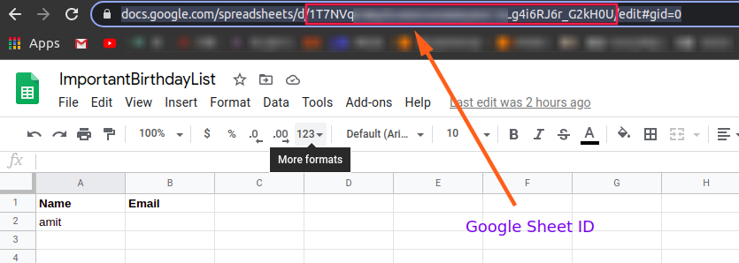

# Birthday reminder Google Script

## Running the script

- Go to [Google App Scripts](https://script.google.com/home)
- Create a new project.
- Paste the [code](./BirthdayReminder.js).
  - Create a google sheet and paste the sheetID.
- Set trigger to trigger it once everyday on desired interval.

Note: trigger should be set after the time when emails arrive. Run the script atleast once to grant the necessary permissions.

- Create a google sheet.
  - Create columns for name and or email.
  - List down the name/emails of friends.

## Get Google Sheet ID

- Create a new google sheet
- Copy the ID from the url.
- 
